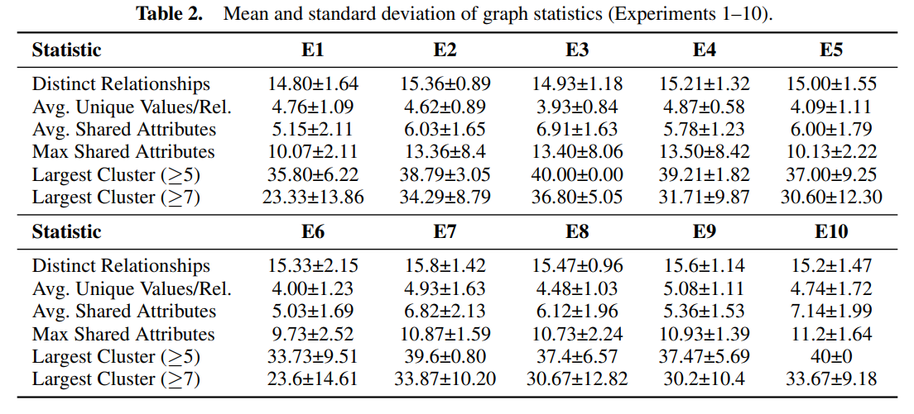

### Queries_for_unlearned/

There are the scripts to run all the selected queries so as to see the statistics of the selected samples as the most influencial and the code to analyse these results.

- run_queries.py
- analyse_results_for queries.py

All the extracted results for each prompt and each experiment can be found in the folder query_statistics and can also be seen in the following table.

This repo demonstrates the power of symbolic reasoning with vision–language models for interpretable generative AI and copyright-aware influence analysis.
