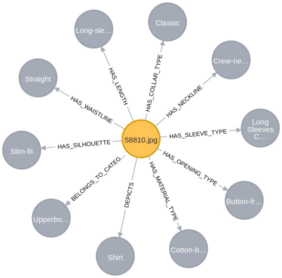

# Graph Fashion Experiments

This directory contains all scripts and resources used to generate and analyse knowledge graphs (KGs) from fashion images using our **Auto-KG Generation pipeline**, powered by a multimodal Large Language Model (LLM).

We employ **LLaMA 3.2 Vision** (via the Ollama library), guided by the [Fashionpedia Ontology](https://fashionpedia.github.io/home/), to extract semantic triples (subject–predicate–object) from each image. These triples are cleaned and structured into **star-shaped knowledge graphs**, stored in a Neo4j database. This symbolic representation enables structured comparison between generated and training images, offering interpretable insights into training data influence.

## Pipeline Overview

**Auto-KG Generation Process:**

Given an input image, the LLM produces ontology-aligned semantic triples:

These triples are inserted into Neo4j as star-shaped graphs, with the image ID at the centre:

This pipeline supports interpretable, concept-level comparisons between images for explainable generative AI.

## 📁 Subfolders Overview

### `ask_llm_clean_triples_insert_db/`
Contains scripts and prompts to extract semantic triples from fashion images using a vision–language model, aligned with the Fashionpedia ontology. This includes both raw and cleaned triples, forming the basis of our knowledge graph generation pipeline.

### `graph_unlearning/`
Implements the full pipeline for graph-based unlearning experiments. It includes image description cleaning, Neo4j graph insertion, influence analysis, and post-unlearning comparison. Results highlight the impact of removing influential training samples.

### `Queries_for_unlearned/`
Provides utilities to analyse influence statistics across prompts and experiments. Runs batch queries and aggregates metrics to identify key training samples.

👉 For more details, each subfolder contains its own `README.md` with extended explanations.

