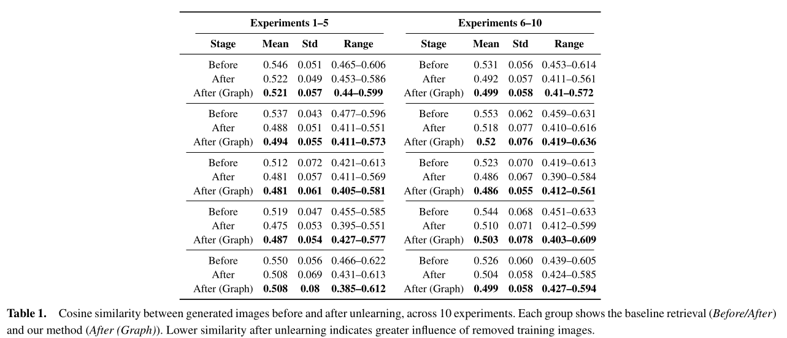

### graph_unlearning/
This folder contains the entire pipeline for **graph-based unlearning experiments**, adapted from our [Search-Based Data Influence Analysis repository](https://github.com/teoaivalis/Search-Based_Data_Influence_Analysis.git).

Also there are the python scripts used to "clean" the descriptions for the generated images and to insert them in the Neo4j Database.

- clean_generated_images.py
- insert_generated_neo4j.py

As a next step we make queries for each generated image so as to find the most similar and then we aggregate the attributes for each experiment.

- query_for_generated_image.sh
- aggregate_attributes.py

After aggregating the results for each prompt in each experiment, we collect the list with the selected samples to be unlearned (removed from the dataset along with their descriptions).

- create_final_list_to_unlearn.py

Finally, after regenerating with the new model, we compare the images before and after unlearning with the reference one, similarly to the baseline.

- compare_after_unlearning.py

The results from this comparison can be found in the subfolder graph_unlearning_metrics and there are also visualised in the following table.

