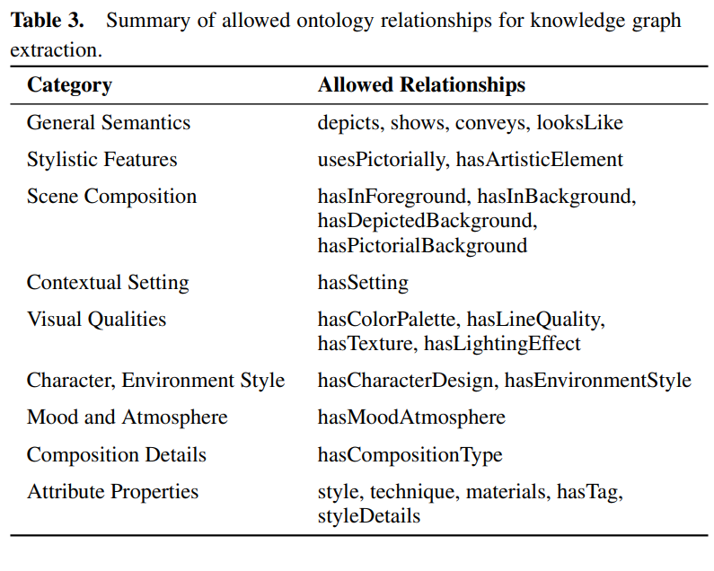
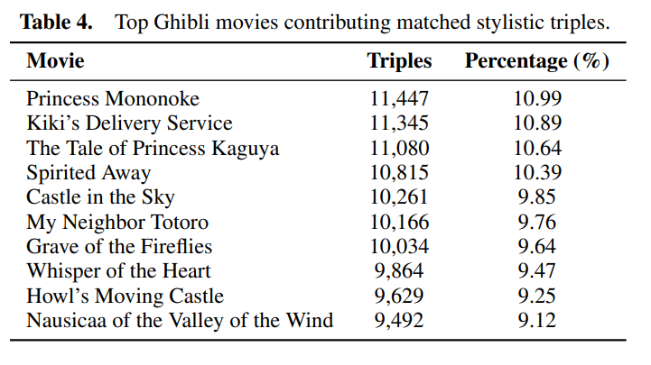

# Ghibli-Style Experiments

This folder contains all scripts, triples, and outputs for analysing the influence of Ghibli-style image generation using our **KG Generation pipeline**. We use a multimodal LLM guided by a structured ontology to extract, align, and compare semantic knowledge from both original and stylised movie frames.

The main objective is to identify and explain the stylistic and semantic differences introduced by the generative model, contributing to interpretability and training data attribution in generative AI systems.

---

## Pipeline Overview

The process consists of several stages, from image frame extraction to structured knowledge graph comparison:

1. **Triple Extraction**  
   - Run `create_triples_ghibli.sh` to call a vision-language model on each image and extract raw semantic triples (subject–predicate–object).  
   - This step uses `ontology.txt` to ensure that all extracted triples are mapped to a fixed ontology.

2. **Triple Cleaning & Alignment**  
   - Use `clean_triples.py` to filter, validate, and align the extracted triples to the ontology.  
   - Cleaned triples from Ghibli-style images are stored in `cleaned_generated_descriptions/` and from original images in `cleaned_originals_descriptions/`.

3. **Semantic Comparison**  
   - Execute `find_differences.py` to compare cleaned triples from each Ghibli-style frame with its original counterpart.  
   - Detected differences are saved into the `differences/` folder, offering insight into how the generation altered image content.

4. **Source Movie Attribution (Optional)**  
   - Use `find_frames.py` to explore individual frames from Ghibli-style movies, which have the triples from the difference folder. They are stored in `found_frames/`
   - Use `find_movies.py` and `find_movies_aggregated.py` to explore from which movies these frames are coming from. Results are stored in `found_movies/`.

---

### Ontology Summary

The ontology defines the allowed semantic relations used during triple extraction and alignment. These relationships fall under categories such as stylistic features, scene composition, mood, and visual quality.

---

## Results

### Top Contributing Ghibli Movies

The following figure shows the top Ghibli movies whose stylistic elements were most frequently matched during comparison:

---
