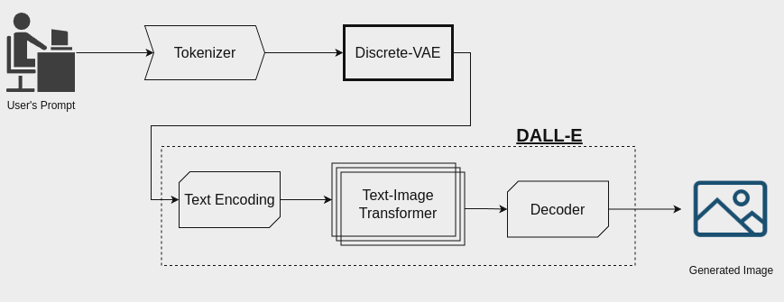

# Local Model

Our local experiments build upon the [Local Dalle-pytorch framework](https://github.com/teoaivalis/Search-Based_Data_Influence_Analysis/tree/main/Local_Dalle), which we faithfully reproduced as a baseline. We then extended this setup by integrating our proposed AutoGraphX Generation method for interpretability and training data influence analysis.

## Install

More information about the local model can be found in the following link:[Dalle-pytorch](https://github.com/lucidrains/DALLE-pytorch#install)

```python
$ pip install dalle-pytorch
```

The architecture of the local model can be visualised in the following figure:


We trained the model using a dataset with fashion items. We trained it with the following parameters:
epochs: 30, batch_size: 5, learning_rate: 4.5e-4, depth: 16, heads: 12, head_dimension: 64.
For our trainings we used 2 GeForce GTX 1080 Ti GPUs with 11 GB RAM.
 
The fashion dataset we used can be downloaded from this [Kaggle link](https://www.kaggle.com/datasets/paramaggarwal/fashion-product-images-dataset)


To generate a set of images run the following:
```
$ python3 generate.py --dalle_path ./fashion_16_12_30ep.pt --text 'Ray-Ban Adults-Men Metallic Fashion Winter 2016 Casual Sunglasses'
```

**train_dalle.py:** Is the file you use to train your own model.

**generate.py:** Is the file you use to generate images with your own prompts.

**config.yaml:** Configuration file to train dalle-pytorch.

