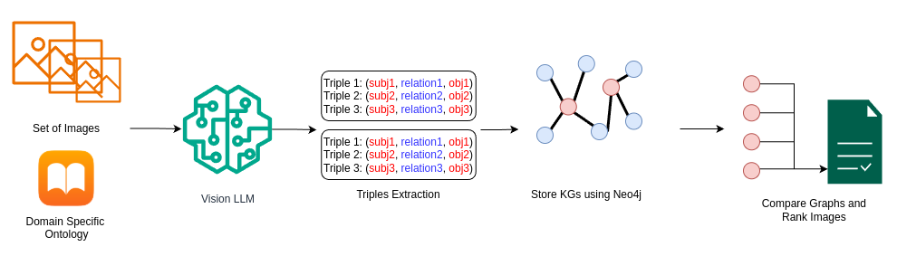

# Interpreting Generative Models through Automatically-Generated Knowledge Graphs

**Abstract:** As generative models become increasingly powerful, concerns around transparency, accountability, and copyright violations have intensified. Understanding how specific training data contributes to a model’s output is critical for ethical AI development. We introduce a framework for interpreting generative outputs through the automatic construction of ontology-aligned knowledge graphs (KGs). While automatic KG construction from natural text has advanced, extracting structured and ontology-consistent representations from visual content remains challenging—due to the richness and multi-object nature of images. Leveraging multimodal large language models (LLMs), our method extracts structured semantic triples from images, aligned with a domain-specific ontology. By comparing the knowledge graphs of generated and training images, users can trace potential influences in an accessible and reviewable way—enabling copyright analysis, dataset transparency, and interpretable AI. We validate our method through experiments on locally trained models via unlearning, and on large-scale models through style-specific image generation. By enhancing transparency and attribution, our framework supports the development of AI systems that foster human creativity and stimulate curiosity, rather than undermine them.

**Keywords:** Knowledge Graphs Generation, Multimodal LLMs, Data Influence Analysis, Graph-Based Retrieval.

# AutoGraphX Generation Pipeline

Our proposed method for knowledge graph generation using multimodal LLMs is illustrated in the figure below.

